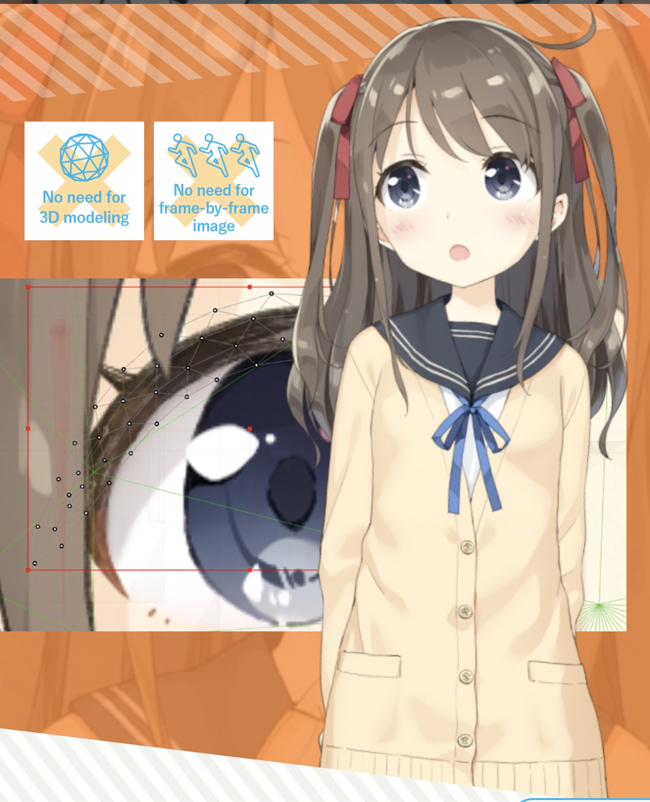

WeIn Roadmap

  
</p
# WeIn 项目心路历程

从四月底开始开发，到五月底大概有一个多月的时间，我们对整个项目的预期或者说定位，发生了"翻天覆地"的变化。

## 虚拟形象（VLive）

项目的第一阶段，团队成员只有两个 Android 开发。最开始的想法也比较朴素，只是想着应用视频 SDK 来完成应用，初步的方向是完成类似 [live-2d](https://www.live2d.com/en/) 的虚拟形象。每位用户都可以选择以虚拟形象或真实形象的方式加入会议。

为了让形象变得更加生动好看，我们又邀请了一位设计同学加入团队完成建模的工作。但是经过技术预研，发现使用 live2d 主要存在两个问题。一方面要使用官方的建模工具，存在比较高的学习成本。另一方面 live2d 是一个商用软件，可能会存在版权问题。

于是最终还是决定搭建 3D 的虚拟形象，虚拟形象的面部表情可以根据用户的实际表情发生变化。

面部表情的捕捉可以使用 [ML Kit](https://developers.google.com/ml-kit) 来完成，可以捕捉到面部关键点，通过关键点计算用户的面部状态。

使用 [Filament](https://github.com/google/filament) 来完成 3D 模型的渲染工作。

此时我们预期的初步目标是屏幕上的虚拟形象会跟随用户转头而转头，离屏幕的距离变化而变大变小，同时也有眨眼和张嘴闭嘴的能力。

模型的移动和旋转可以简单的在渲染时添加变换矩阵来实现，面部表情的变化经过一番踩坑，也通过形变动画实现了效果。

### 第一个大坑——虚拟形象的距离感

很快就遇到了第一个比较棘手的点，如何实现虚拟形象随用户离屏幕的距离而变大变小。

最初的想法是通过 face 的 bounding box 尺寸的变化来实现缩放，后来发现这种方式并不靠谱…当用户转头的时候，就会出现比较大的误差。

又尝试了通过 ML Kit 数据中的欧拉角来实现，也没有达到我们预期的效果。

也想过了通过关键点缩放等等方式，要不是效果不尽如人意，或者就是实现不够优雅。

又经过了一番分析，发现本质问题是我们试图通过二维的信息来解决一个三维的问题，摄像机捕捉到的信息是一张二维的照片，而我们实际控制的是一个三维的模型。与其说是放大缩小，倒不如说是**提供距离感**更加准确。

因为投影相机的存在，本就存在着近大远小的显示效果，所以除了 xy 轴的位置，只要再提供给模型 z 轴的位置信息，距离感就自然而然的出现了。

柳暗花明，我们发现了 [ARCore](https://developers.google.com/ar) 的存在。与使用 **ML Kit** 处理二维的图像信息不同，**ARCore** 可以通过采集到的数据建立用户面部的三维模型，也就可以提供 z 轴的位置信息。比较好的解决了“距离感”的问题。

### 更多想法

通过 **ML Kit** 可以获取到面部关键点，我们设想可以通过这些关键点来添加除眨眼张嘴之外的更丰富的表情。也可以使用关键点数据来调整模型，生成和用户神似的模型，实现千人千面的效果。当然也可以实现类似捏脸这样一些有趣的功能。只是限于建模精度复杂度等等原因，暂时没有做更多的探索。

## 虚拟场景（VScene）

### 第一道灵感火花

虽然虚拟形象已经可以有一些比较好玩的应用，但我们还是感觉差了一些什么，应该可以更好玩更有新意。

直到第一道灵感火花的出现，为我们注入了新的动力。

ARCore 的应用擦出了火花，它的出现让我们的世界观从二维升格到了三维。我们有了通过 AR 技术把虚拟形象放置到现实世界中的想法，但是限于手机屏幕的尺寸，其沉浸感会差一些，体验可能会低于我们的预期。

但是 AR/VR 与真实世界的交互方式，为我们打开了一扇全新的大门。虚拟形象放到现实世界中会觉得奇怪，那么一个虚拟的场景呢？

于是，VScene 出现了。

手机屏幕变成了一扇窗，连接起了现实与虚拟。

我们通过传感器捕获设备方向，根据手机屏幕的朝向来调整用户看到的虚拟世界的视角。转动手机四处探索，好像在另一个世界里转头侧身，一种全新的体验。

想到了电影中的场景，没有了物理屏幕，而是更加科幻的全息投影，这个场景成为了我们新的灯塔。对于一场会议，可以有两种接入方式，虚拟形象模式或者视频模式。

仿佛坐在一面弧形的全息投影墙对面，左右转动手机，就可以看到一个个或是虚拟形象接入或是视频接入的参会者。

### 虚拟世界里走出的第一步

当然比较可惜的是，限于没有想到很好的三维形象与二维视频同时存在且不觉得违和的方式，全息投影墙的方案最终没有被落地。

我们选择了另外一种实现成本更低一些的方案，每个参会者都是一个小人，可以在虚拟场景中自由的移动。

由二维的视频画面升格到三维虚拟形象，传统的混音方式变得有些不合时宜了。

很自然而然的，我们迈出了探索空间音频的第一步，也是这一步让虚拟场景真正有了革命般的应用场景。

既然每个参会者都是虚拟场景中的一份子，那么它必然有着一个空间位置。

在现实世界中，如果听到了一个声音，我应该可以辨别出它的源头来自哪个方向，离我是远还是近。

对于有着空间位置的虚拟场景，也应该是这样的表现才更加符合直觉。

很快就想到了有趣的应用场景。传统的多人会议中，要想保证清晰，那么在同一时刻，最好只有一位参会者在发言。

但是在虚拟世界中不是这样的，虽然是一场会议，但是更像是一个让大家聚在一起的空间。可以所有人都聚在一起听一位分享者发言，当然也可在大圈子之外有小圈子，在主讲人之外，可以走到更远一点的地方有小圈子之间的讨论。某种程度上，一场在线会议的容量被扩大了。

那么不妨再往前走一步，如果调用 Agora 的云录制接口，在录制音视频内容的同时，将每个参会者的虚拟形象的位置和方向信息也记录下来，也就有了另一个好玩的 feature。

在会议进行的时候，可能仅仅参与了一个小圈子的讨论，但是在回放里，可以自由的移动到场景的任何一个位置听到任意一个圈子的讨论。 

限于时间原因，录制能力暂时还未能实现。

## 协同世界（WeIn）
